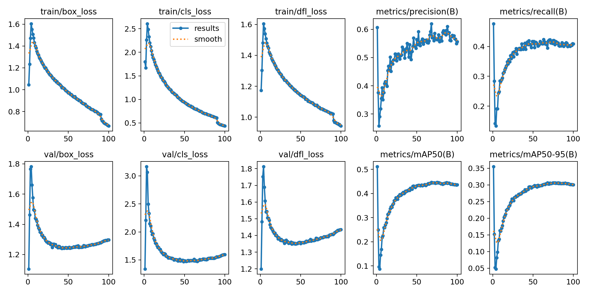
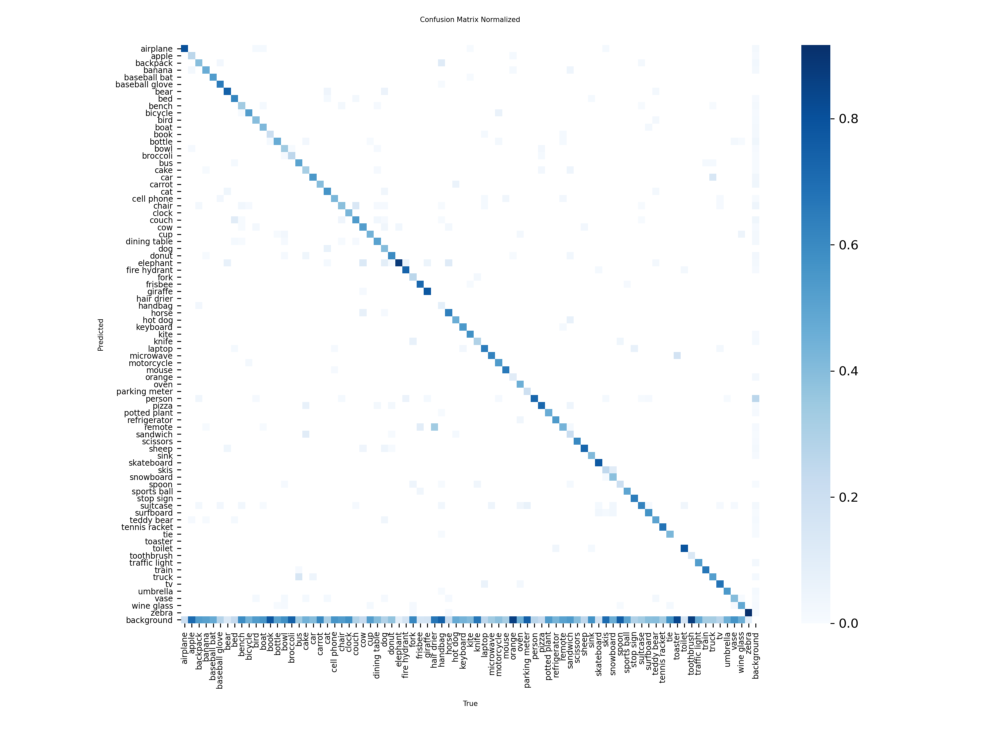

# 🎥 Object Detection and Tracking in Video Streams

[](https://objectdetectioninvideo.streamlit.app/)

## 📌 Overview
This repository contains an end-to-end machine learning pipeline designed to ingest raw video feeds, detect and track specific objects, and export the tracking data into structured CSV reports. Built using the state-of-the-art YOLO11 architecture and ByteTrack algorithms, this project demonstrates how to transform unstructured computer vision data into actionable, quantifiable metrics suitable for enterprise reporting and analytics.

---
## 🎯 Key Objectives
- Detect objects from video frames
- Track objects across frames using unique IDs
- Count objects without duplication
- Export results into structured data formats

---
## 🧠 Core Features

### 🔹 Interactive Web Interface (Streamlit)
- **Live Preview:** Extracts the first frame of the uploaded video to preview the counting zone.
- **Dynamic Controls:** Users can adjust the counting ROI (Region of Interest) using percentage-based sliders.
- **Cloud Hosted:** Fully deployable on Streamlit Community Cloud with headless OpenCV support.

### 🔹 Object Detection (YOLO11)
- Uses Ultralytics YOLO11m
- Trained on COCO (80 classes)
- Configuration:
  - Epochs: 100
  - Batch Size: 16
  - Image Size: 640
---
### 🔹 Multi-Object Tracking (ByteTrack)
- Maintains persistent tracking IDs
- Prevents:
  - Double counting
  - Frame-to-frame inconsistency
---
### 🔹 ROI-Based Counting System
- Defines a dynamic counting zone
- Counts objects only when entering the region
- Ensures accurate event-based counting

```python
if zone_x1 < cx < zone_x2 and zone_y1 < cy < zone_y2:
    if track_id not in counted_ids:
        counted_ids.add(track_id)
```
---
### 🔹 Automated Data Export
- Generates structured output:
```bash
total_counts.csv
```
Example:
```bash
| Object Type | Total Count |
|------------|------------|
| Person     | 32         |
| Car        | 18         |
| Dog        | 5          |
```
---
### 🔹 Video Annotation & Export
- Annotates:
  - Bounding boxes
  - Class labels
  - Tracking IDs
  - Counting zone
- Converts output to web-ready MP4 using FFmpeg
---
## 📊 Model Performance

### 🔹 Training Results
<p align="center">  </p>

- Shows loss convergence, precision, recall, and mAP trends
- Indicates stable training and good generalization

### 🔹 Confusion Matrix
<p align="center">  </p>

- Strong diagonal → correct classifications
- Minimal class confusion across dataset

---
## 📁 Project Structure
``` bash
📦 object-detection-in-video
│
├── Models/
│   └── best.pt
│
├── NoteBook/
│   └── object_detection_in_video.ipynb
│
├── app/
│   ├── app.py
│   └── requirements.txt
|
├── outputs/
│   ├── web_ready_output.mp4
│   └── total_counts.csv
│
├── Results/
│   ├── Training_result.png
│   └── Confusion_matrix.png
│
└──pacakges.txt
│
└── LICENSE
│
└── README.md

```
---

## ⚙️ Tech Stack

| Category            | Technology              |
|--------------------|------------------------|
| Language           | Python                 |
| Detection          | YOLO11 (Ultralytics)   |
| Tracking           | ByteTrack              |
| Video Processing   | OpenCV                 |
| Dataset Platform   | Roboflow               |
| Compression        | FFmpeg                 |

---
## 🚀 How to Run
### Option 1: Live Web App (Recommended)
You can test the application instantly without installing anything by visiting the live deployment:
👉 [View Live App Here](https://objectdetectioninvideo.streamlit.app/)

### Option 2: Run Locally (Streamlit Interface)
### 1️⃣ Clone Repository
```bash
git clone https://github.com/TamimHq/ObjectDetectionInVideo
cd ObjectDetectionInVideo
```
### 2️⃣ Install Dependencies
```bash
pip install -r requirements.txt
```
### 3️⃣ Launch the App
```bash
streamlit run app.py
```
### Option 3: Jupyter Notebook (Training & Evaluation)
To retrain the model or view the raw evaluation pipeline:
Run all cells to:
- Open ```NoteBook/object_detection_in_video.ipynb.```
- Train model (optional)
- Evaluate performance
- Process video
- Generate outputs
---

## 📦 Outputs

| Output Types | File |
|--------------|------|
|🎥 Annotated Video|web_ready_output.mp4|
|📊 CSV Report|total_counts.csv|
---

## 💡 Real-World Applications
- 🚗 Traffic flow monitoring
- 🏙️ Smart city infrastructure
- 🏭 Industrial object tracking
- 🛒 Retail analytics
- 🎥 Surveillance systems
---

## 🔒 Notes
- API keys removed for security
- Model weights included for inference
- Compatible with Google Colab + local setup
---

## 📬 Contact
Tamim Haque
Feel free to connect for collaboration or questions!
